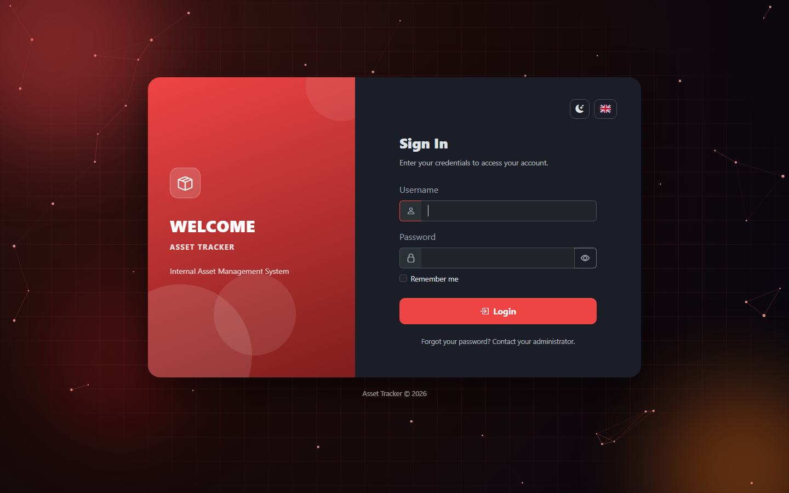
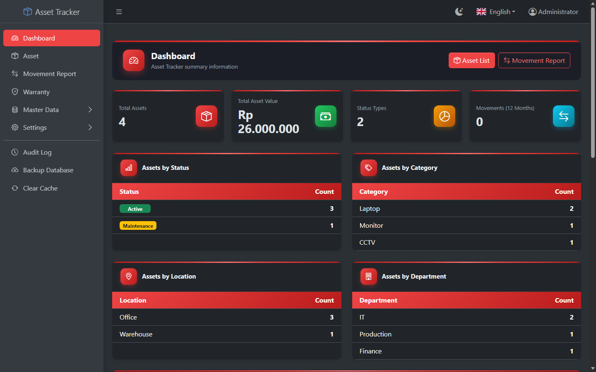
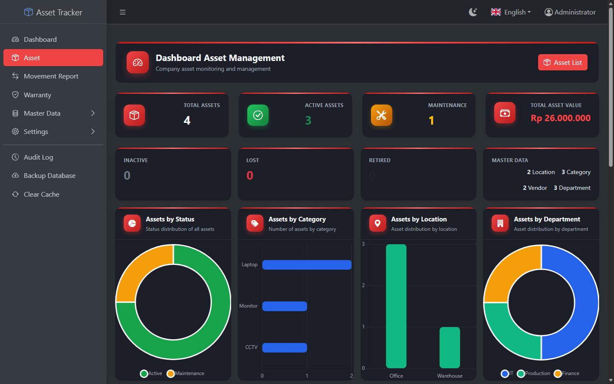
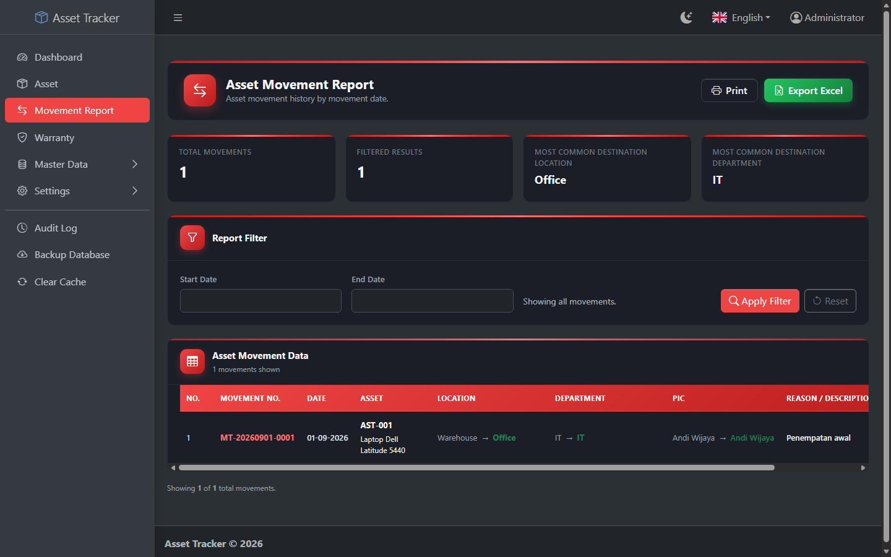
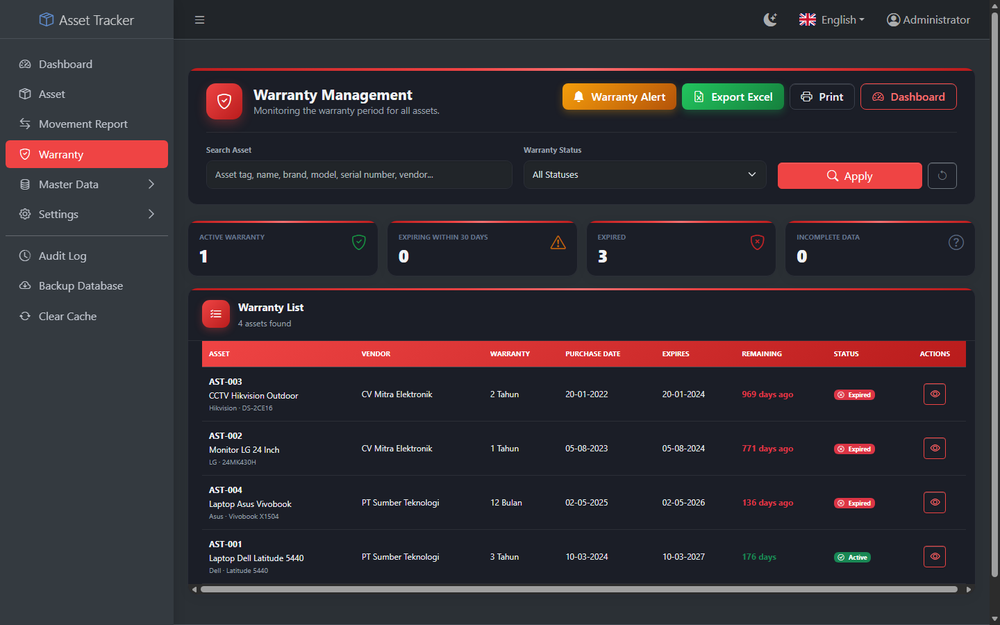

# Asset Tracker

Aplikasi internal untuk mencatat dan mengelola aset perusahaan: data aset,
mutasi/perpindahan aset antar lokasi/departemen/PIC (dengan bukti mutasi
dan verifikasi lewat QR code), masa warranty, backup/restore database,
serta manajemen user dan hak akses (role & permission) per halaman.
Tersedia dalam Bahasa Indonesia dan English.

## Fitur Utama

- **Manajemen Asset** — tambah/edit/hapus asset, foto asset, cetak label/QR,
  import & export Excel.
- **Mutasi Asset** — catat perpindahan lokasi/departemen/PIC, riwayat mutasi,
  koreksi mutasi, bukti mutasi digital (tanda tangan) & QR verifikasi.
- **Warranty** — pantau status warranty seluruh asset (aktif/akan habis/habis),
  riwayat perubahan warranty.
- **Role & Hak Akses** — role bawaan (Administrator/Admin/User) maupun role
  custom, hak akses diatur per halaman (Create/Read/Edit/Delete).
- **Audit Log** — catatan aktivitas siapa mengubah apa dan kapan.
- **Backup & Restore** — backup database + foto ke satu file `.zip`, dan
  restore kembali dari file backup.
- **Master Data** — Kategori, Lokasi, Departemen, Vendor.
- **Pengaturan Aplikasi** — nama aplikasi, logo, profil perusahaan, menu
  sidebar custom.
- **Multi-bahasa** — Bahasa Indonesia & English, bisa diganti dari halaman
  manapun.

## Screenshot

| Login | Dashboard |
|---|---|
|  |  |

| Daftar Asset | Laporan Mutasi |
|---|---|
|  |  |

| Warranty Management |
|---|
|  |

> Data pada screenshot di atas adalah data contoh (dummy), bukan data
> perusahaan sungguhan.

## Teknologi

Python 3.10+, Flask, SQLAlchemy (Flask-Migrate/Alembic), Flask-Login,
Flask-WTF (CSRF), Flask-Limiter (rate limiting), Flask-Babel (i18n),
Bootstrap 5 + AdminLTE 4. Database default SQLite, bisa diganti ke
PostgreSQL/MySQL lewat `DATABASE_URL`. Server produksi memakai waitress.

---

## Instalasi (Development)

### 1. Prasyarat

- Python 3.10 atau lebih baru ([python.org](https://www.python.org/)) — saat
  install di Windows, centang **"Add Python to PATH"**.
- Git.

### 2. Clone Repository

```bash
git clone https://github.com/r0corp/Asset_Tracker_Orulabs.git
cd Asset_Tracker_Orulabs
```

### 3. Buat Virtual Environment & Install Dependency

```bash
python -m venv venv
```

Aktifkan virtual environment:

```bash
# Windows
venv\Scripts\activate

# macOS / Linux
source venv/bin/activate
```

Install dependency:

```bash
pip install -r requirements.txt
```

Untuk development (butuh menjalankan test), pakai:

```bash
pip install -r requirements-dev.txt
```

### 4. Konfigurasi `.env`

Copy `.env.example` menjadi `.env`:

```bash
# Windows
copy .env.example .env

# macOS / Linux
cp .env.example .env
```

Generate `SECRET_KEY` acak dan isi ke `.env`:

```bash
python -c "import secrets; print(secrets.token_hex(32))"
```

Buka `.env`, isi:

```
SECRET_KEY=<hasil generate di atas>
```

> `DATABASE_URL` boleh dikosongkan — secara default aplikasi memakai SQLite
> lokal di `instance/asset.db` (folder & file akan dibuat otomatis).

### 5. Setup Database (sekali saja, saat pertama kali)

```bash
python -m flask --app run.py db upgrade
python seed_admin.py
python seed_roles.py
python seed_menu.py
```

`seed_admin.py` membuat akun administrator pertama:

```
username: admin
password: admin123
```

**Segera login dan ganti password ini setelah instalasi selesai.**

### 6. Jalankan Aplikasi (Development)

```bash
python run.py
```

Buka `http://127.0.0.1:5000` di browser.

> `run.py` menjalankan development server Flask (`debug=True`) — cukup untuk
> coding/testing di komputer sendiri, **jangan dipakai untuk diakses dari
> komputer lain/jaringan**. Untuk itu, lihat bagian **Deployment Production**
> di bawah.

### 7. Menjalankan Test

```bash
python -m pytest tests/ -q
```

---

## Deployment Production

Panduan lengkap memindahkan aplikasi ke 1 PC/server yang diakses banyak
orang di jaringan kantor (termasuk setup firewall, auto-start sebagai
Windows Service, dan strategi backup) ada di [DEPLOYMENT.md](DEPLOYMENT.md).

Ringkasnya, di server produksi aplikasi dijalankan lewat WSGI server
(waitress), bukan `run.py`:

```bash
python serve_production.py
```

---

## Manual Pemakaian Singkat

### Login

Buka halaman login, masukkan username & password. Tersedia toggle mode
gelap/terang dan pilihan bahasa (Indonesia/English) di pojok kanan atas
kartu login.

### Menambah Asset

**Asset → Tambah Asset**. Isi Asset Tag (kode unik), nama, kategori,
lokasi, departemen, vendor, tanggal & harga pembelian, masa warranty, dan
foto (opsional). Setelah disimpan, QR code asset otomatis dibuat.

### Mencatat Mutasi (Perpindahan) Asset

**Laporan Mutasi** atau dari halaman detail asset → **Catat Mutasi**. Isi
lokasi/departemen/PIC tujuan dan alasan perpindahan. Sistem mencatat posisi
asal secara otomatis dari histori sebelumnya, dan menghasilkan bukti
mutasi yang bisa dicetak beserta QR verifikasi.

### Memantau Warranty

**Warranty** menampilkan status warranty semua asset (Aktif / Akan Habis /
Habis / Data Tidak Lengkap), dengan filter dan detail peringatan untuk
warranty yang butuh perhatian segera.

### Mengatur Role & Hak Akses

**Settings → Role Management** (khusus Administrator). Buat role baru,
atur izin Create/Read/Edit/Delete per halaman (asset, mutasi, master data,
dsb). Role bawaan (`administrator`, `admin`, `user`) tidak bisa dihapus
atau diganti nama.

### Menambah User

**Settings → User** (khusus Administrator). Tambah user baru dan tentukan
role-nya. User tidak bisa menghapus akun miliknya sendiri.

### Backup & Restore Database

**Backup Database** (khusus Administrator):

- **Buat Backup Baru** — membuat file `.zip` berisi seluruh database dan
  foto asset/logo, tersimpan di folder `backups/`.
- **Restore** — pilih salah satu file backup, ketik `RESTORE` (huruf besar
  semua) untuk konfirmasi. Backup pengaman otomatis dibuat dulu sebelum
  data lama ditimpa. Setelah restore, semua user otomatis logout.

### Mengganti Bahasa & Tema

Tersedia di pojok kanan atas setiap halaman (ikon bendera untuk bahasa,
ikon bulan/matahari untuk tema gelap/terang). Berlaku untuk seluruh
halaman dan tersimpan di sesi login.

### Log Aktivitas

**Log Aktivitas** (khusus Administrator) mencatat siapa menambah/mengubah/
menghapus data apa dan kapan — berguna untuk audit dan menelusuri
perubahan.
